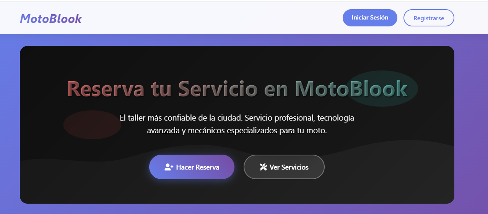
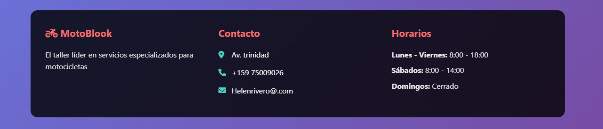

 🏍️✨ **TALLER MOTOS** ✨

**Taller Motos** es un proyecto web desarrollado como trabajo final en la materia de **Sistemas Informáticos**, que busca gestionar y organizar las reservas de servicios en un taller mecánico de motocicletas.  

El proyecto refleja la aplicación práctica de todos los conocimientos adquiridos durante el año, utilizando herramientas modernas de desarrollo web como **HTML, CSS, PHP, MySQL y XAMPP**.

---

 💡 **Descripción General**

El sistema permite **registrar clientes, gestionar servicios y organizar reservas** de manera digital.  
Con una interfaz clara y funcional, facilita la comunicación entre el taller y los clientes, agilizando el trabajo y mejorando la atención.

 🎯 **Objetivos Principales**
- Modernizar el proceso de atención en talleres mecánicos.  
- Centralizar los datos de clientes y servicios en una base de datos.  
- Fortalecer las habilidades en diseño web y programación.  
- Poner en práctica la teoría aprendida en la materia de Sistemas Informáticos.  

---

 🧠 **Tecnologías Utilizadas**

| 💻 Herramienta | 🧩 Uso Principal |
|----------------|------------------|
| **HTML5 / CSS3** | Estructura y diseño visual del sitio |
| **PHP** | Lógica del servidor y conexión con base de datos |
| **MySQL** | Gestión y almacenamiento de datos |
| **XAMPP** | Servidor local de pruebas |
| **Visual Studio Code** | Entorno de desarrollo principal |

---

 ⚙️ **Características del Proyecto**
- 📋 Registro y gestión de clientes.  
- 🛠️ Control de servicios y reservas.  
- 🧾 Conexión a base de datos MySQL.  
- 🔐 Validación básica de formularios.  
- 💎 Diseño limpio y adaptable.  

---

🧭 **Aprendizaje y Avances en la Materia de Sistemas Informáticos**

El desarrollo de este proyecto fue el resultado de todo lo aprendido a lo largo de los tres trimestres del año.

---

🧩 **Primer Trimestre**
- Elaboración de la **documentación inicial del proyecto** (viabilidad, objetivos, planificación).  
- Estudio de **direcciones IP**, redes locales y su funcionamiento.  
- Conocimiento general sobre **lenguajes de programación** y sus aplicaciones.  

---

 💻 **Segundo Trimestre**
- Creación de **páginas web con Visual Studio Code**.  
- Uso de **HTML, CSS y JavaScript** para construir interfaces interactivas.  
- Desarrollo de **sitios individuales y grupales**, aplicando buenas prácticas de diseño.  

---

 🗂️ **Tercer Trimestre**
- Culminación de la **documentación y el producto final**.  
- Creación de **páginas dinámicas conectadas a bases de datos** (PHP–MySQL).  
- Trabajo colaborativo en **equipos de desarrollo web**.  
- Integración de todos los conocimientos para producir un sistema funcional.  

---

 🌟 **Conclusión**

El proyecto **Taller Motos** representa mucho más que una simple página web: es el reflejo del crecimiento, la dedicación y la capacidad de aplicar la teoría en la práctica.  
Durante el desarrollo de este trabajo aprendimos a planificar, diseñar, programar y resolver problemas reales utilizando herramientas tecnológicas que nos preparan para el ámbito profesional.  

A lo largo del año, enfrentamos desafíos técnicos y de trabajo en equipo que nos permitieron comprender la importancia de la organización, la comunicación y la constancia en el desarrollo de sistemas informáticos.  
El resultado final es un proyecto funcional y bien estructurado que demuestra el esfuerzo conjunto y el compromiso con la mejora continua.  

**Taller Motos** es, en definitiva, una muestra de cómo el aprendizaje puede transformarse en una solución práctica, útil y significativa.

> 💬 *“El verdadero aprendizaje se logra cuando lo que sabes cobra vida en lo que creas.”*

---

 👩‍💻 **Autoras**

- **Sahory Delaida Córdova Alba**  
- **Helen Johana Rivero Castro**

📘 *Materia:* Sistemas Informáticos  

📆 *Gestión:* 2025
